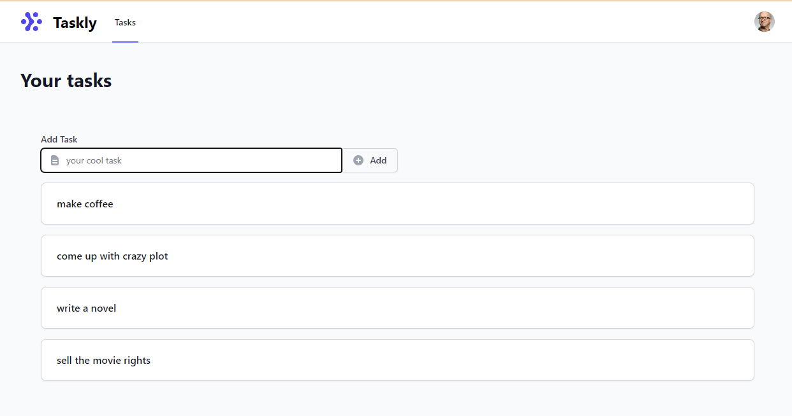
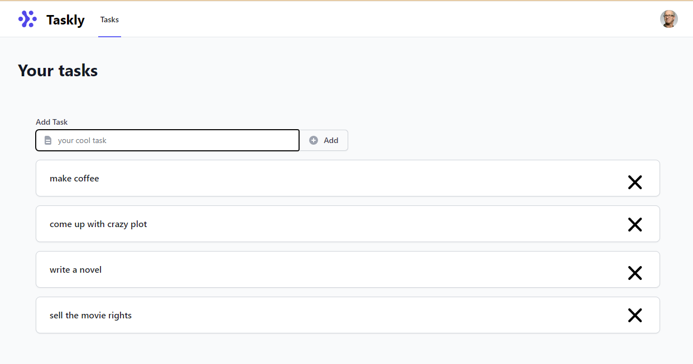

# Software Engineer I Take Home Assessment 

This is the repository for the System Initiatives Software Engineer I take-home assessment. It is designed to verify that:

* You can take well scoped software development tasks and execute them on an existing code base.
* You have some proficiency with Javascript / [Typescript](https://www.typescriptlang.org/).

We use a take-home assessment so that you can have your most productive environment at hand. Use whatever editor, operating system, etc. you like. Google to your hearts content. 

We want you to spend no more than 4 hours on this assessment. If that's not enough
time to finish, that's okay - tell us what you would do if you had more time.

## What you'll be doing

We've created a fake company called Taskly, and you've been hired as a software
engineer. We're going to explain what Taskly is, who their customers are, and 
an opportunity we have to improve the product for them. That opportunity will
be broken down into engineering tasks that we will ask you to complete. 

To get started, [fork this repository](https://docs.github.com/en/get-started/quickstart/fork-a-repo). If you prefer, you can make your fork private and add `adamhjk`,
`fnichol`, and `mahirl` as collaborators. When you've finished, let us know
via email, with a link to your fork. We'll review it and get back to you!

Have fun!

## Taskly

You've just taken a new job working for Taskly - a new company that's 
reinventing the task list!

### Taskly in one sentence

Taskly is the easiest way for forgetful people to remember the things 
they need to do.

### Current Screenshot

### The opportunity: completing tasks

Taskly focused on letting people put their new tasks into the application 
first - so they wouldn't forget them! When they talked to people about how they
keep their task list today, though, there is an important thing missing -
completing a task! 

The opportunity is to allow users to not only remember the things they need to 
do, but to complete them when they've finished!

### The user story: completing a task by removing it from the list

#### Who is the user?

Agatha Christie, Mystery Writer. She writes complex murder mystery novels,
and needs to remember a lot of tasks.

#### How do we believe they will use it?

  * To remove a task from the list when it is complete
  * To remove a task from the list if they enter it wrong

#### What does it look like?

#### How will the software work?

  * Clicking the 'X' button removes the task from the UI.
  * Frontend calls a backend API for removing a task from the list

#### How will we demo this software?

  * Sign in to Taskly
  * Add a task "drink coffee"
  * Add a task "write mystery novel"
  * Click the 'X' button next to "drink coffee"
  * See that there is only "write mystery novel" in the list
  * Log out of Taskly
  * Sign back in to Taskly
  * See that there is only "write mystery novel" in the list

### Work breakdown

 * Add the 'X' button to the task list in `ListTasks.vue`. Use the [X Heroicon](https://heroicons.com/).
 * Add a `tasksRemove` function to the `task` model in the backend, and a corresponding test. It should require the `userId` and a `taskId`.
 * Add a `delete` route to the backend for `/api/tasks/:userId/:taskId`.
 * Add a `removeTask` handler to the backend, which calls the `taskRemove` model function. Add the corresponding test.
 * Add an `@click` handler to the 'X' button that calls your new backend API.

## How to run Taskly

Taskly is split into two components - a `frontend` and a `backend`. Both need to 
be running in order for you to add the remove feature. Our advice is to run each
in a separate terminal window or tab. Each component has its own readme, with
full instructions on how to run it.

# Good luck!

Thank you so much for taking the time to do the assessment. We're looking forward
to reviewing your work!
